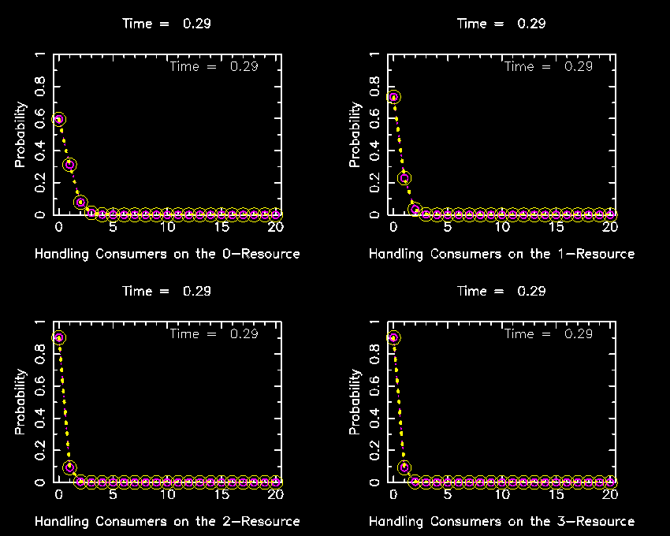

# README #

This project runs on linux machines out of the box. To run in other platforms makefiles should be modified accordingly. See makefile to see the suitable modifications for Mac users (tested on a Maverick version).

The follwing dependencies are required:

## GNU Scientific Library (GSL)
This is a numerical library for C and C++ programmers. It is free software under the GNU General Public License.
## CPGPLOT Graphix Library.
This is a set of functions written in C relying on cpgplot primitives from pgplot, and plplot. As a consequence, the CPGPLOT Graphix library, in turns, depends on:
### [pgplot](/http://www.astro.caltech.edu/~tjp/pgplot/)
### [plplot](http://plplot.sourceforge.net/)
You can git clone the CPGPLOT library from my repository.

### What is this repository for? ###

* This repository models the feeding dynamics of a population of consumers when attacking and handling multiple resource species. The model can consider the dynamics distributed across a metatapopulation network structure. Individual movement of consumers is implemented as a random walk betweeen connected patches (Markov jump process). However, this code accompanies a submitted paper where consumer movement is not in use. The dynamics is set up both as an ODE system and as Markov jump processes in continuous time. The temporal dynamics of the whole probability distribution over configurational states can also be numerically integrated via the Master Equation formalism. Several methods that optimize the generation of stochastic realizations of the system of Gillesipie type have been implemented. Several analytical results on the temporal evolution of the probability distribution and its stationary analytical solution are tested.  

* Version: 0.0.0.999
* [Learn Markdown](https://bitbucket.org/tutorials/markdowndemo)

### How do I get set up? ###

First you should install the libraries to meet the dependencies mentioned above. Look for GSL, pgplot and libplplot12 in your usual package handler.
Notice that the linking command from most makefiles contains, at least, the following libraries:

* -lgsl -lgslcblas
* -lWL -lpng -lplplotd -lpgplot -lcpgplot
* -lda_cpgplot_XY_GRID_FILE -lda_cpgplot_BASIC

The first two ones are basic GSL libraries. The following 5 are required to use primitive plotting functions from the graphic libraries cpplot and plplot. The final two are mandatory when using higher-level plotting functions from the CPGPLOT Graphix library. All of them are usually required to produce a graphical output. However, the control variable (see any makefile) 'CPG" can also be set up to 'NON_CPG_REPRESENTATION' and, then, through conditional compilation, the same program is built to just run only the numerical computations without graphics. In all cases, the output may be saved in files.

When you git clone the repository on your machine, you should do it from your home directory. As a result, the directory '~/PROJECT_HOLLINLG_II_nD' will be created on your machine.

If graphic libraries have been correctly installed, this should be enough to make all makefiles work out of the box. Remember though you require to have also git cloned my CPGPLOT repository on your machine. To be clear, you should end up with two directories:

* -$ ./CPGPLOT
* -$ ./PROJECT_HOLLING_II_nD

both in you home directory.

* Summary of set up:
	+ #### 1. Install GSL library
	+ #### 2. Install plplot library
	+ #### 3. Install pgplot library
	+ #### 4. git clone https://github.com/vankampen92/CPGPLOT
	+ #### 5. git clone https://github.com/vankampen92/PROJECT_HOLLING_II_nD.git
	+ #### 6. Tests:

	In order to test if pgplot, plplot and CPGPLOT are correctly installed in your machine, you can expand the tar file PROJECT_CPGPLOT_EXAMPLES.tar, which is in the project root directory on your home directory. Then you will get the directory ~/PROJECT_CPGPLOT_EXAMPLES. In that directory, there is a simple example of how to use the CPGPLOT library. You build it by typing:

		+ ~/PROJECT/CPGPLOT_EXAMPLES/make

		and you will get the exectutable file PLOT. You may run the example with some command arguments (see main.c). You should get a graph with four different subplots. You may also type:

		+ ~/PROJECT/CPGPLOT_EXAMPLES/PLOT -h

		and see other available command line arguments. You may also type:

		+ ~/PROJECT/CPGPLOT_EXAMPLES/PLOT -G29 ?

	and see the different avaiable graphic formats in which plots can be saved. Notice that sometimes the value for these input arguments is overriden by the internal program code. When this happens, it is for a good reason. Please check the code to understand why and make moodgodfications at your own risk. Be creative.   

	+ #### 7. Examples:
	See, for instance, ./MODEL_CALCULATIONS/TEMPORAL_EVOLUTION_MASTER_EQUATION/main.c, and follow the directions to compile and run the code:

		+ ~$ make MODEL=DIFFUSION_HII_nD 

		+ ~$ ./DIFFUSION_HII_nD -y0 16 -y2 1 -HS 5 -HM 1 -HX 1 -HY 1 \
                          -n 5 -v0 0 -v1 1 -v2 2 -v3 3 -v4 4 \
                          -G0 1 -G1 5 -G2 1 -G3 0.0 -G4 6.0 -G5 1 -G6 0.0 -G7 8 \
                          -tn 25 -t0 0.0 -t1 2.5 -t4 0 -tR 10000 -xn 0 -xN 20.0 -tE 0.2 \
                          -HuR 0.0 -HuC 0.0 -H5 0.0 \
                          -HK 10000 -H0 5.0 -H2 1.0 -H9 0.5 -H10 0.1 \
                          -Hp1 0.3725 -Hp2 1.0 -HN 20

	The code depends on some auxiliary libraries in ./Library  and ./Definition_Error_Model subdirectories. You may notice that you need to generate these libraries before, and then execute the command 'make MODEL=DIFFUSION'. In principle, a recursive makefile does this job for you. However, if gcc does not find these libraries, they may have been accidentally deleted and you should build them back up again from sources. Also, the code is linked against R libraries.  You may remove these R links or install R in your system. I recommend this 2n option. This will allow you to create shared libraries that, then, can be called as standard R funcions from RStudio, for example.

	The call on the 2nd line above generates a bunch of stochatic realizations (-tR 10000) and presents the temporal evolution of 5 output variables that represent the number of consumers that are handling each of the resource item types (-n 5), on a central and single cell (-HM 1) for 25 times (-tn 25) between 0 and 2.5 (-t0 0.0 -t1 2.5). This is done also through the numerical integration of the associated ODE system for the averages, and also through the use of the temporal evolution of whole probability distribution via numerical integration of the master equation. In this regard, several analytical results are tested (see companion paper). Here the grid is reduced to a single cell (1 x 1 grid, -HX 1 -HY 1). Populations thrive within this 1 cell (-HM 1). However, several networks can be implemented. The type of network in controled by the -y2 imput argument value. For instance, if -y2 1, a regular squared grid with Von Neumann neighboruhoods and periodic boundary conditions is used. In this example, this feature is not used.

	A graphical output (click on the image to see an animated version) representing the temporal evolution of the marginals from the temporal evolution of the whole probability distribution calculated by both numerically integrating the master equation and through the analytic result (a time-dependent multinomial as reported in the companion paper) is given here for 4 resource types (input arguments as before but -HS 4 -n4 -G0 2 -G1 2 -t1 3.0, yellow, analytic solution, magenta, numerical integration. The actual values of the discrete propbability distributions are represented in circles (broken lines between circles are only a guide to the eye). 

  

### Contribution guidelines ###

* Writing tests
* Code review
* Other guidelines

### Who do I talk to? ###
code
* Drop an email to David Alonso (<dalonso@ceab.csic.es>)
