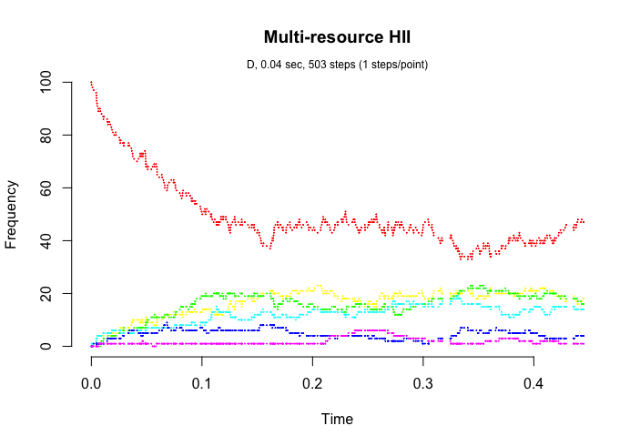
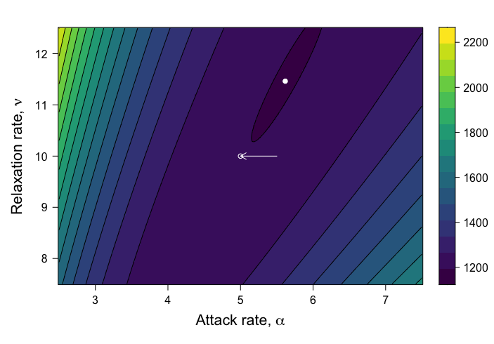
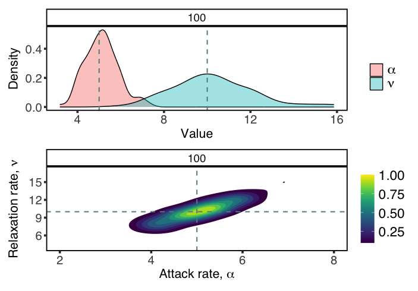
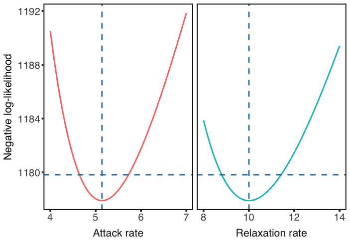

# Code from: Out-of-equlibrium inference of feeding rates through population data from generic consumer-resource stochastic dynamics

This repository contains code needed for the analyses presented in the paper 'Out-of-equlibrium inference of feeding rates through population data from generic consumer-resource stochastic dynamics'.

The manuscript can be found in the arXiv file: [https://arxiv.org/abs/2401.01632](https://arxiv.org/abs/2401.01632) 

## Code/software

Several R scripts are included and can be used to reproduce the results in the manuscript.

#### File: SSA-realization.R

**Description:** This file uses the library *GillespieSSA* to generate model realizations of the multi-resource model described in the manuscript. The temporal dynamics of free predators is plotted. Initially there are 100 free consumers (red time series) and none of them handling any prey (remaining series).

#### File: Heatmaps.R

**Description:** Given a single realization of the stochastic process, this file computes negative log-likelihood and plots a heatmap of this variable when parameters (attack and relaxation rates) are screened. If *flag=0*, sampling times are drawn uniformly on [0,10T], being T the characteristic time of the dynamics.  If *flag=1*, sampling times are drawn uniformly on [10T,20T], being T the characteristic time of the dynamics.

This file generates manuscript's Figure 2.

#### File: ML-estimation.R

**Description:** This file estimates parameters from a matrix gathering several realizations of the stochastic process ending at different times. A number of estimates is obtained (by collecting repeated realizations) to determine the distribution of each parameter value. 

This file generates manuscript's Figure 3.

#### File: IC-log-likelihood.R

**Description:** This script computes log-likelihood profiles, which are then used to estimate confidence intervals for parameter estimates.

This file generates manuscript's Figure 4.

#### File: Heatmaps.marginals.R

**Description:** As in *Heatmaps.R*, given a single realization of the stochastic process (accounting only for the number of free predators), this file computes negative log-likelihood and plots a heatmap of this variable when parameters (attack and relaxation rates) are screened. If *flag=0*, sampling times are drawn uniformly on [0, 10T], being T the characteristic time of the dynamics.  If *flag=1*, sampling times are drawn uniformly on [10T, 20T], being T the characteristic time of the dynamics.

This file generates manuscript's Figure 5.

#### File: ML-estimation-marginals.R

**Description:** Instead of collecting all the information from the process (tracking abundances over time for every behavioral type), this file considers only the number of free predators. Independent observations of this abundance at different times allows to estimate parameters, as in *ML-estimation.R*. 

This file generates manuscript's Figure 6.

#### File: ML-estimation-deterministic.R

**Description:** Here an alternative to maximum-likelihood is implemented, based on the exact solution in the deterministic limit. 

This file generates manuscript's Figure D1.

#### File: mytheme_ggplot.R

**Description:** This script contains some specifications for figure appearance.
